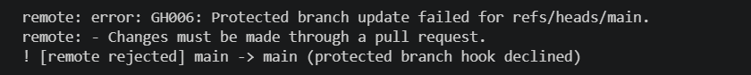
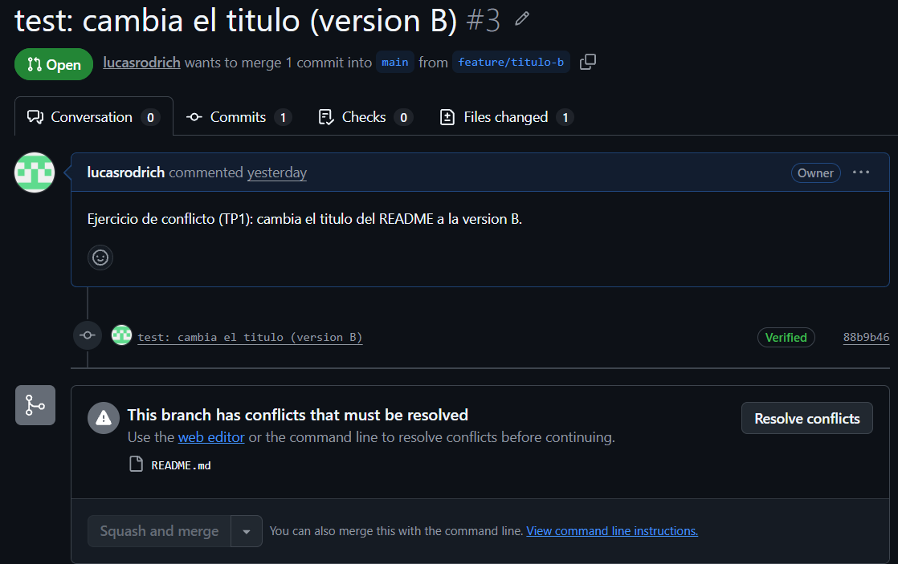
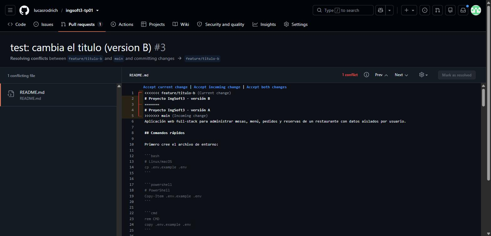
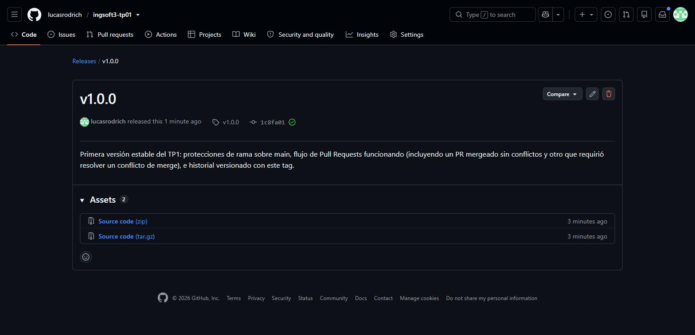

# Evidencias — TP1

## 1. Push directo a `main` rechazado

Con la protección de rama activa (`main` sin bypass ni para el administrador del repo), un intento
de `git push` directo a `main` es rechazado por GitHub con un error de tipo *protected branch hook
declined*.

## 2. El PR de la rama B no se puede mergear: conflicto

La rama `feature/titulo-b` y la rama `feature/titulo-a` modifican la misma línea del `README.md`
(el título) partiendo ambas de `main`. Una vez mergeado el PR de la rama A, el PR de la rama B queda
marcado por GitHub como *"This branch has conflicts that must be resolved"*: no se puede mergear
automáticamente.

## 3. Los marcadores del conflicto

Al abrir "Resolve conflicts" en el PR de la rama B, el editor web muestra el archivo con los
marcadores `<<<<<<<`, `=======` y `>>>>>>>` delimitando las dos versiones en pugna: la de la rama
actual (`feature/titulo-b`, versión B) contra la que ya está en `main` (versión A, la que trajo el
merge de la rama A).

## 4. La release publicada

La release `v1.0.0`, creada sobre el tag homónimo en `main`, publicada desde la sección *Releases*
del repositorio con su título y sus notas.
