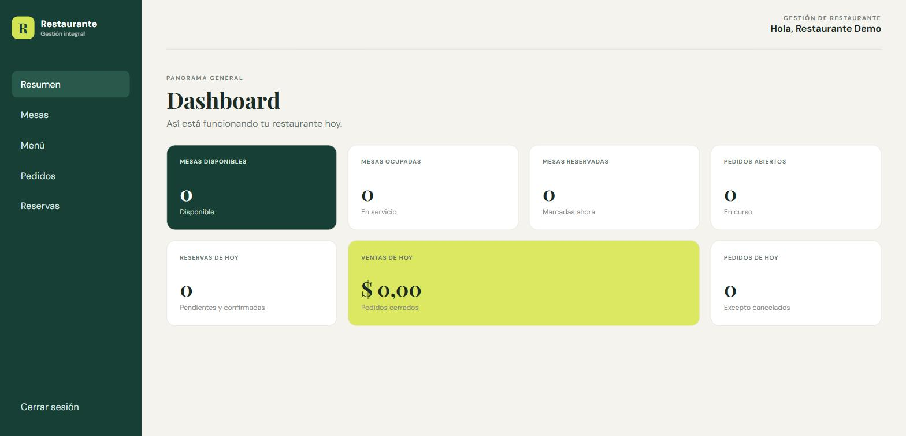
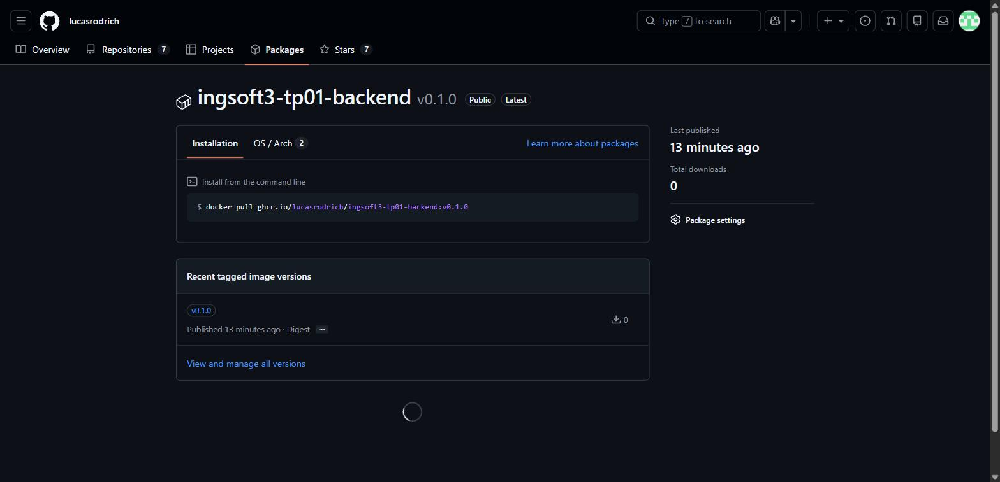
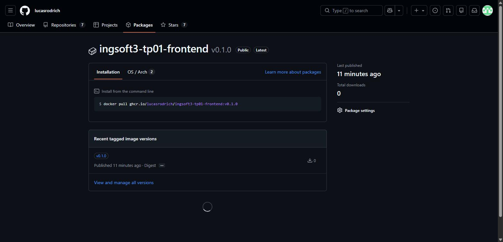

# Evidencias — TP1

## 1. Push directo a `main` rechazado

Con la protección de rama activa (`main` sin bypass ni para el administrador del repo), un intento
de `git push` directo a `main` es rechazado por GitHub con un error de tipo *protected branch hook
declined*.

## 2. El PR de la rama B no se puede mergear: conflicto

La rama `feature/titulo-b` y la rama `feature/titulo-a` modifican la misma línea del `README.md`
(el título) partiendo ambas de `main`. Una vez mergeado el PR de la rama A, el PR de la rama B queda
marcado por GitHub como *"This branch has conflicts that must be resolved"*: no se puede mergear
automáticamente.

## 3. Los marcadores del conflicto

Al abrir "Resolve conflicts" en el PR de la rama B, el editor web muestra el archivo con los
marcadores `<<<<<<<`, `=======` y `>>>>>>>` delimitando las dos versiones en pugna: la de la rama
actual (`feature/titulo-b`, versión B) contra la que ya está en `main` (versión A, la que trajo el
merge de la rama A).

## 4. La release publicada

La release `v1.0.0`, creada sobre el tag homónimo en `main`, publicada desde la sección *Releases*
del repositorio con su título y sus notas.

## TP2 — Contenedores

### 1. `docker compose up -d --build` funcionando end-to-end

El dashboard del frontend, servido por el contenedor de nginx en `localhost:3000`, cargando datos
reales que vienen del backend (`localhost:8080`), que a su vez los lee de la base en el contenedor
`db`. Los tres servicios quedaron `healthy`:

```
NAME                       IMAGE                    SERVICE    STATUS
ingsoft3-tp01-backend-1    ingsoft3-tp01-backend    backend    Up (healthy)
ingsoft3-tp01-db-1         postgres:17-alpine       db         Up (healthy)
ingsoft3-tp01-frontend-1   ingsoft3-tp01-frontend   frontend   Up (healthy)
```

### 2. Prueba de persistencia
Se creó un usuario y una mesa (`numero: 99`) contra la API:

```
$ curl -s localhost:8080/api/mesas -H "Authorization: Bearer $TOKEN"
[{"id":1,"numero":99,"capacidad":4,"estado":"disponible","createdAt":"2026-08-19T19:23:05Z"}]
```

Después de `docker compose down` (sin `-v`) y `docker compose up -d`, la mesa **sigue ahí** con el
mismo `id` — el volumen sobrevivió:

```
$ curl -s localhost:8080/api/mesas -H "Authorization: Bearer $TOKEN"
[{"id":1,"numero":99,"capacidad":4,"estado":"disponible","createdAt":"2026-08-19T19:23:05Z"}]
```

Después de `docker compose down -v` (con `-v`) y `docker compose up -d`, el mismo token quedó
inválido (`{"error":"Autenticación requerida."}`, 401) porque el usuario ya no existe, y al
registrar el mismo usuario de nuevo la lista de mesas aparece **vacía**: el volumen se borró junto
con el contenedor.

```
$ curl -s localhost:8080/api/mesas -H "Authorization: Bearer $TOKEN_NUEVO"
[]
```

### 3. Comparación de tamaño de imágenes
```
REPOSITORY               TAG           SIZE
ingsoft3-tp01-backend    latest        308MB
ingsoft3-tp01-frontend   latest        74MB
python                   3.13-slim     178MB
node                     22-alpine     232MB
nginx                    1.27-alpine   74.5MB
```
El caso más claro del ahorro del multi-stage es el frontend: la etapa de build usa `node:22-alpine`
(232MB, con todo el toolchain de Node para compilar) pero esa etapa **nunca viaja a producción** — la
imagen final pesa 74MB, prácticamente lo mismo que la base `nginx:1.27-alpine` sola, porque solo le
agrega los estáticos ya compilados.

### 4. Imágenes publicadas en el registry


Las dos imágenes (`ghcr.io/lucasrodrich/ingsoft3-tp01-backend:v0.1.0` y
`ghcr.io/lucasrodrich/ingsoft3-tp01-frontend:v0.1.0`) publicadas y con visibilidad **Public**. Se
verificó que la visibilidad es real —no solo lo que dice la etiqueta— haciendo `docker logout ghcr.io`
y después `docker pull` de la imagen sin ninguna sesión iniciada: la descarga funcionó igual. También
se probó `docker-compose.registry.yml` de punta a punta (tras borrar la imagen local, sus tags y el
build cache) y el `up` mostró `Pulling`/`Pulled` en vez de construir, levantando el sistema completo
solo con las imágenes del registry.
